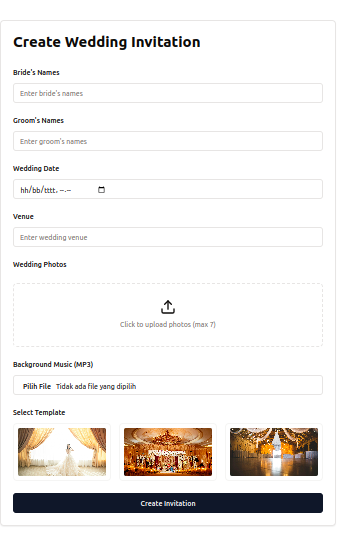

# 🎉 Wedding Invitation Generator  

Aplikasi web untuk membuat **undangan pernikahan digital** yang indah dan interaktif. 🥰  


## ✨ Fitur

- 🎨 **3 Template** desain yang menarik  
- 📸 **Upload hingga 7 foto** pernikahan  
- 🎵 **Latar musik** dengan file MP3  
- ⏰ **Hitung mundur otomatis** ke hari pernikahan  
- 🔗 **Bagikan undangan** dengan URL unik  
- 🕹️ **Animasi transisi smooth** (Framer Motion)  
- 📱 **Responsive** untuk desktop & mobile  

---

## 🛠️ Tech Stack

### **Frontend**
- React + TypeScript  
- TailwindCSS & ShadcnUI (UI Styling)  
- Framer Motion (Animasi)  
- TanStack Query (State Management)  
- Wouter (Routing)  

### **Backend**
- Express.js (Server)  
- SQLite3 + Drizzle ORM (Database)  
- Multer (File Upload)  

---

## 📌 Instalasi

### 1️⃣ **Kloning Repository**
```sh
git clone <repo-url>
cd wedding-invitation-generator
```

### 2️⃣ **Instal Dependensi**
Pastikan **Node.js (v18 atau lebih baru)** sudah terinstal.

```sh
npm install
```

### 3️⃣ **Setup Environment**
Salin `.env-example` menjadi `.env`:
```sh
cp .env-example .env
```

### 4️⃣ **Menjalankan Aplikasi**
Jalankan perintah berikut untuk memulai backend dan frontend secara bersamaan:
```sh
npm run dev
```

- **Server berjalan di:** `http://localhost:5000`  
- **Frontend berjalan di:** `http://localhost:5173`  

---

## 📸 Screenshots  

| Halaman | Screenshot |
|---------|-----------|
| **Home** |  |
| **Form Undangan** |  |
| **Preview Undangan** |  |

---

## 📄 Lisensi  
Proyek ini dirilis dengan lisensi **MIT**. 🚀  
